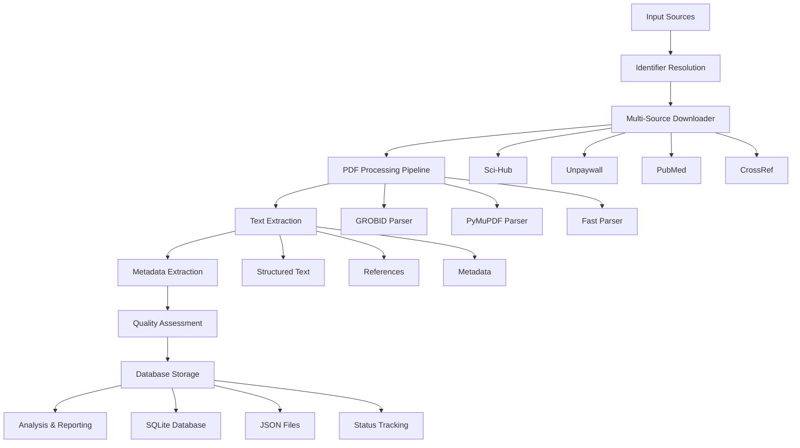

# 🧬 Sci-Hub API: Advanced Paper Collection System for Aging Research

> **STAGE 2: Full Text Collection System** - A comprehensive, high-performance academic paper collection and processing pipeline designed specifically for aging research and theory identification. This system represents the SECOND stage of a larger research initiative focused on systematically identifying and analyzing all possible aging theories through advanced text mining and natural language processing.

## 🎯 Stage Overview

### Stage 2: Full Text Collection
This repository represents **Stage 2** of a multi-phase aging research pipeline:

- **Stage 1**: [download_agent](https://github.com/DianaZagirova/download_agent) - Literature discovery and metadata collection
- **Stage 2**: [scihub_api](https://github.com/your-repo/scihub-api) - Full-text retrieval and processing (this repository)

The Stage 1 repository creates a comprehensive database of ids of potential aging-related papers through systematic querying of multiple academic sources. 
This Stage 2 repository then retrieves and processes the full-text content of those papers using advanced PDF parsing and multi-source download capabilities.

### Quick Start

1. **Clone the repository**
   ```bash
   git clone https://github.com/your-repo/scihub-api.git
   cd scihub-api
   ```

2. **Set up Stage 1 Database** (Required)
   
   This project depends on the test database created by Stage 1 of the aging research pipeline. You need to run the demo from the [download_agent](https://github.com/DianaZagirova/download_agent) repository first:
   
   ```bash
   # Clone and set up Stage 1
   git clone https://github.com/DianaZagirova/download_agent.git
   cd download_agent
   python -m venv venv
   source venv/bin/activate
   pip install -r requirements.txt
   
   # Run Stage 1 demo to create test database
   python demo.py
   
   # Note the path to the created database
   # Default: ./paper_collection_test/data/papers.db
   ```

3. **Create virtual environment**
   ```bash
   cd ../scihub-api  # Return to this repository
   python -m venv venv
   source venv/bin/activate  # On Windows: venv\Scripts\activate
   ```

4. **Install dependencies**
   ```bash
   pip install -r requirements.txt
   ```

5. **Set up GROBID server** (optional, for advanced parsing)
   ```bash
   docker run -d --name grobid -p 8070:8070 lfoppiano/grobid:0.8.0
   ```

6. **Run the demo**
   ```bash
   # With default test database path
   python demo.py
   
   # Or specify custom test database path
   python demo.py --test-db /path/to/download_agent/paper_collection_test/data/papers.db
   ```

### Demo Script
Run the comprehensive demo to validate all functionality:

```bash
python demo.py
```

The demo will:
1. Analyze the test database
2. Demonstrate fast PDF parsing
3. Test GROBID integration
4. Show Unpaywall functionality
5. Validate parallel processing
6. Generate comprehensive reports

### Test Database Configuration

The system requires a test database created by Stage 1 of the aging research pipeline:

- **Custom Location**: Can be specified using `--test-db` parameter
- **Source**: Created by running `python demo.py` in the [download_agent](https://github.com/DianaZagirova/download_agent) repository
- **Contains**: Sample aging research papers with DOIs, titles, and abstracts
- **Purpose**: Validation and demonstration of functionality

#### Configuring Test Database Path

The test database path can be configured in several ways:

1. **Command Line Argument** (Recommended):
   ```bash
   python demo.py --test-db /path/to/your/test_database.db
   ```

2. **Default Path**: If no path is specified, uses the default location

3. **Environment Variable**: Can be set via environment variable (future enhancement)

#### Creating the Test Database

To create the required test database, follow these steps:

1. Clone and set up Stage 1 repository:
   ```bash
   git clone https://github.com/DianaZagirova/download_agent.git
   cd download_agent
   python -m venv venv
   source venv/bin/activate
   pip install -r requirements.txt
   ```

2. Run Stage 1 demo to create test database:
   ```bash
   python demo.py
   ```

3. Note the path to the created database (typically `./paper_collection_test/data/papers.db`)

4. Use this path when running Stage 2 demo:
   ```bash
   cd ../scihub-api
   python demo.py --test-db /path/to/download_agent/paper_collection_test/data/papers.db
   ```
## Results

~90% full-text recovering rate

## 🚀 Key Features & Technologies

### 🔬 Advanced PDF Processing
- **Dual Parser Architecture**: Integration of both GROBID and PyMuPDF for maximum extraction accuracy
- **Intelligent Fallback**: Automatic switching between parsers based on success rates and quality metrics
- **Structure Preservation**: Maintains document structure including sections, references, and metadata
- **Multi-Mode Processing**: Simple, structured, and full extraction modes for different use cases

### 🌐 Multi-Source Paper Retrieval
- **Sci-Hub Integration**: Direct access to paywalled academic papers
- **Unpaywall API**: Open Access paper discovery and download
- **PubMed Integration**: Automatic DOI resolution from PubMed IDs
- **CrossRef API**: Title-based paper discovery and DOI resolution

### ⚡ High-Performance Processing
- **Parallel Processing**: Multi-threaded processing for 6-8x speed improvements
- **GPU Acceleration**: GROBID GPU support for 1.5-2x faster processing
- **Intelligent Caching**: Skip already processed papers to avoid redundant work
- **Rate Limiting**: Respectful API usage with configurable delays

### 📊 Comprehensive Tracking & Monitoring
- **Real-Time Status Tracking**: Live monitoring of processing status
- **Comprehensive Logging**: Detailed logs for debugging and analysis
- **Progress Reporting**: Real-time progress updates and statistics
- **Error Recovery**: Automatic retry mechanisms for failed downloads

### 🔧 Production-Ready Features
- **Database Integration**: SQLite database for metadata storage and tracking
- **Configuration Management**: YAML-based configuration for easy customization
- **Docker Support**: Containerized deployment for reproducibility
- **API Endpoints**: RESTful API for integration with other systems

## 🏗️ System Architecture



## 📦 Installation & Setup

### Prerequisites
- Python 3.8 or higher
- Docker (for GROBID server)
- 8GB+ RAM (recommended for parallel processing)
- 50GB+ disk space (for paper storage)
- **Stage 1 Database**: Test database from [download_agent](https://github.com/DianaZagirova/download_agent) repository


### Advanced Setup

For production deployment or large-scale processing:

```bash
# Clone and setup
git clone https://github.com/your-repo/scihub-api.git
cd scihub-api

# Create virtual environment
python -m venv venv
source venv/bin/activate

# Install dependencies
pip install -r requirements.txt

# Configure GROBID with GPU support
cp config.json.example config.json
# Edit config.json with your GROBID server details

# Initialize database
python -c "from src.core.database import init_db; init_db()"

# Run comprehensive demo
python demo.py
```

## 🚀 Usage Examples

### Basic Usage

#### Download and Process Single Paper
```bash
# By DOI
python download_papers.py 10.1038/s41586-019-1750-x

# By PubMed ID
python download_papers.py 32265220

# By title
python download_papers.py "Aging and cellular senescence"
```

#### Batch Processing
```bash
# Process multiple papers from file
python download_papers.py -f papers.txt --parser fast -w 4

# Use GROBID for high-quality extraction
python download_papers.py -f papers.txt --parser grobid -w 2

# Process existing PDFs only
python download_papers.py -p --mode structured
```

### Advanced Usage

#### Parallel Processing (Recommended for Large Batches)
```bash
# Process 1000 papers with 8 parallel workers
python parallel_download.py -f large_paper_list.txt -w 8 --delay 1.0

# Expected performance: ~2-3 hours for 1000 papers
# vs 16-20 hours with sequential processing
```

#### Open Access Paper Discovery
```bash
# Find and download Open Access papers
python unpaywall_downloader.py --file dois.txt --email your@email.com

# Search by title for OA papers
python unpaywall_downloader.py --search "aging mechanisms" --oa-only
```

#### Custom Processing Modes
```bash
# Simple mode (fastest, text only)
python download_papers.py -f papers.txt --mode simple

# Structured mode (sections + references)
python download_papers.py -f papers.txt --mode structured

# Full mode (complete metadata + structure)
python download_papers.py -f papers.txt --mode full
```

## 📊 Performance Benchmarks

### Processing Speed Comparison

| Parser | Mode | Speed (papers/min) | Quality | Use Case |
|--------|------|-------------------|---------|----------|
| Fast Parser | Simple | 120-180 | Good | Quick text extraction |
| Fast Parser | Structured | 60-90 | Very Good | Balanced speed/quality |
| Fast Parser | Full | 60-90 | Excellent | Complete metadata |
| GROBID | Default | 15-25 | Excellent | High-quality extraction |
| GROBID | GPU | 25-40 | Excellent | Maximum quality |

### Parallel Processing Performance

| Workers | Papers/Hour | Speed Improvement | Memory Usage |
|---------|-------------|-------------------|--------------|
| 1 | 60-90 | 1x | 2GB |
| 4 | 240-360 | 4x | 4GB |
| 8 | 480-720 | 8x | 8GB |
| 12 | 600-900 | 10x | 12GB |

## 🔬 Research Applications

### Aging Research Focus
This system is specifically designed for aging research applications:

- **Theory Identification**: Systematic collection of papers proposing aging theories
- **Mechanism Analysis**: Extraction of aging mechanisms and pathways
- **Intervention Studies**: Collection of papers on aging interventions
- **Comparative Analysis**: Cross-paper analysis of aging concepts

### Text Mining Capabilities
- **Named Entity Recognition**: Automatic identification of aging-related terms
- **Concept Extraction**: Extraction of aging concepts and relationships
- **Citation Analysis**: Analysis of paper citations and references
- **Temporal Analysis**: Tracking of aging research trends over time

## 📈 Monitoring & Analytics

### Real-Time Monitoring
```bash
# Check processing status
python check_scripts/check_database_status.py

# View processing statistics
python doi_tracker.py --stats

# Monitor GROBID server
python check_scripts/check_grobid_gpu.py
```

## 🔧 Configuration

### Main Configuration (`config.json`)
```json
{
  "grobid_server": "http://localhost:8070",
  "batch_size": 1000,
  "timeout": 90,
  "max_workers": 12,
  "logging": {
    "level": "INFO",
    "console": true,
    "file": "logs/processing.log"
  }
}
```

### Environment Variables
```bash
# GROBID server configuration
export GROBID_SERVER_URL="http://localhost:8070"

# Database configuration
export DATABASE_PATH="/path/to/papers.db"

# Logging configuration
export LOG_LEVEL="INFO"
```

## 📚 Documentation

### Key Documentation Files
- `documentation/COMPLETE_SYSTEM_SUMMARY.md` - System overview
- `documentation/PERFORMANCE_GUIDE.md` - Performance optimization
- `documentation/GROBID_SETUP.md` - GROBID configuration
- `documentation/PARALLEL_PROCESSING_GUIDE.md` - Parallel processing guide

## 🛣️ CODE FOR THE NEXT STEP 

- **Stage 3:** LLM Judge system – see https://github.com/DianaZagirova/judge_agent


